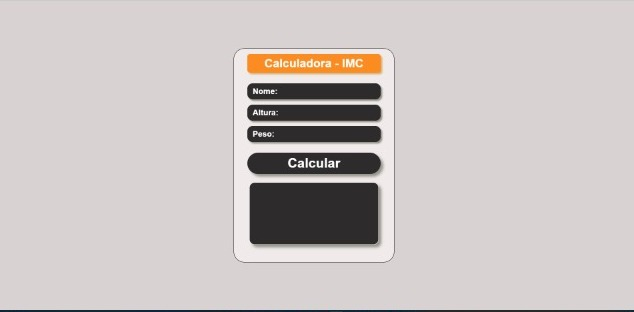

<div id="top">

# - Calculadora - IMC

## Índice

<br>

- [Visão geral](#visão-geral)
- [O desafio](#the-challenge)
- [Captura de tela](#captura-de-tela)
- [Links](#links)
- [Meu processo](#meu-processo)
- [Tecnologias](#tecnologias-utilizadas)
- [O que aprendi](#o-que-eu-aprendi)
- [Desenvolvimento contínuo](#desenvolvimento-contínuo)
- [Autor](#autor)
- [Agradecimentos](#agradecimentos)

<br>

## Visão geral

### O desafio

Os usuários devem ser capazes de:

- Inserir os dados como o nome, altura e peso.
- Após confirmar os dados no botão calcular, deverá aparecer no campo de descrição o resultado do IMC (Índice de massa corporal), se a pessoa está dentro do peso ou não.
<br>
<br>
<br>
<h1>

### Captura de tela
<br>

<h3>Calculadora</h3>
<div align="center">
  
</div>


### Links


- Veja o deploy: [Calculadora - IMC](https://js-imc-calculadora.netlify.app/)

<h1></h1>

## Meu processo

### Tecnologias utilizadas

- HTML5 
- CSS 
- Flexbox
- JavaScript 
- Markup
<br>
<br>
<h1>

### O que eu aprendi

Neste projeto pude evoluir minhas habilidades na linguagem JavaScrip, com a utilização dos testes condicionais de if e else para execução das instruções de código.
<br>
<br>

<a href="#top"> Voltar ao topo</a>
<h1>


### JavaScript

Estou cada vez mais melhorando minha lógica, e notando que posso realizar diversas funcionalidades com esta linguagem, e esta sendo de suma importância estar em contato com o código todos os dias, pois consigo aprender novas funcionalidades com maior frequência de tempo.  

Orgulho de código criado em JS.

```js
const calcular = document.getElementById('calcular');

function imc () {
    const nome = document.getElementById('nome').value;
    const altura = document.getElementById('altura').value;
    const peso = document.getElementById('peso').value;
    const resultado = document.getElementById('resultado');

    if (nome !== '' && altura !== '' && peso !== '') { // Se estiver preenchido

        const valorIMC = (peso / (altura * altura)).toFixed(1);

        let classificacao = '';

        if (valorIMC < 18.5){
            classificacao = 'abaixo do peso';
        }else if (valorIMC < 25) {
            classificacao = 'com peso ideal, Parabéns!.';
        }else if (valorIMC < 30) {
            classificacao = 'levemente acima do peso.'; 
        }else if (valorIMC < 35) {
            classificacao = 'com obesidade grau I.'; 
        }else if (valorIMC < 40) {
            classificacao = 'com obesidade grau II.'; 
        }else {
            classificacao = 'com obesidade grau III. Cuidado!'; 
        }   
           
        resultado.textContent = `Olá ${nome}, o seu IMC é ${valorIMC}, e você está ${classificacao}`;

    }else {
        resultado.textContent = 'Preencha todos os campos, por favor!!';
    }
}

calcular.addEventListener('click', imc);
```
<h1>

<br>

### Desenvolvimento contínuo

*Estou em contato diariamente com o código, e está sendo incrível a evolução que venho obtendo nesses últimos dias, meu objetivo principal é estar cada dia mais preparado tecnicamente para realização de novos projetos.*

<h1>


## Autor 

**LEANDRO PEREIRA**

## Me siga nas Redes:

<a href="https://linkedin.com/in/leandropereira-dev/" target="_blank">
    
</a>
<a href="https://www.instagram.com/le_codigo/" target="_blank">
    
</a> 

<br>
<br>
<h1>
<a href="#top">Voltar ao topo</a>